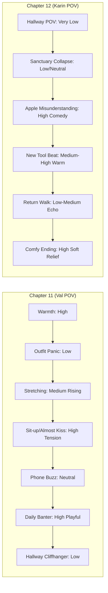

```mermaid
graph LR
    subgraph CH11["Chapter 11 (Val POV)"]
      A1[Warmth: High] --> A2[Outfit Panic: Low]
      A2 --> A3[Stretching: Medium Rising]
      A3 --> A4[Sit-up/Almost Kiss: High Tension]
      A4 --> A5[Phone Buzz: Neutral]
      A5 --> A6["Daily" Banter: High Playful]
      A6 --> A7[Hallway Cliffhanger: Low]
    end
    
    subgraph CH12["Chapter 12 (Karin POV)"]
      B1[Hallway POV: Very Low] --> B2[Sanctuary Collapse: Low/Neutral]
      B2 --> B3[Apple Misunderstanding: High Comedy]
      B3 --> B4[New Tool Beat: Medium-High Warm]
      B4 --> B5[Return Walk: Low-Medium Echo]
      B5 --> B6[Comfy Ending: High Soft Relief]
    end
```

